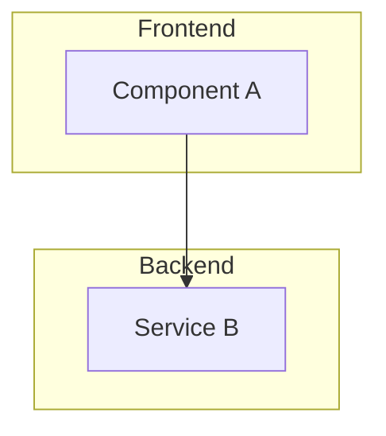
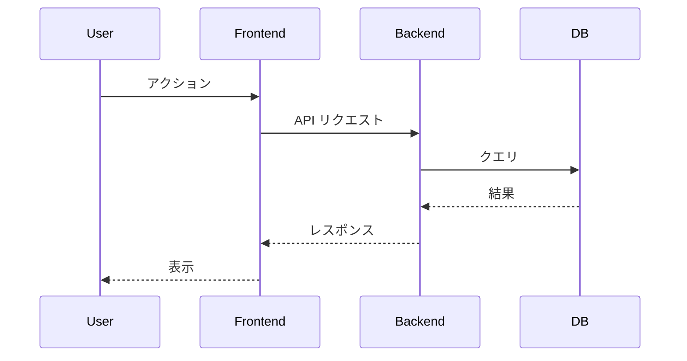

# 詳細設計

## コンポーネント設計

<!-- 各モジュールの責務、インターフェース -->

### コンポーネント一覧

| コンポーネント | 責務 |
| --- | --- |

### コンポーネント図



## シーケンス図

<!-- 主要フローの mermaid シーケンス -->



## API 設計

<!-- エンドポイント、リクエスト/レスポンス -->

### エンドポイント一覧

| メソッド | パス | 説明 |
| --- | --- | --- |

### API 詳細

#### `GET /api/resource`

**リクエスト**

```json
{}
```

**レスポンス**

```json
{}
```

## データベース設計

<!-- テーブル定義、インデックス -->

### テーブル定義

#### `table_name`

| カラム | 型 | 制約 | 説明 |
| --- | --- | --- | --- |

### インデックス

| テーブル | カラム | 種類 |
| --- | --- | --- |

## 開発タスク

<!-- タスク分割、優先順位 -->

| # | タスク | 優先度 | 依存 |
| --- | --- | --- | --- |
| 1 | | High | - |
| 2 | | Medium | 1 |
