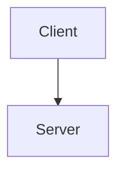
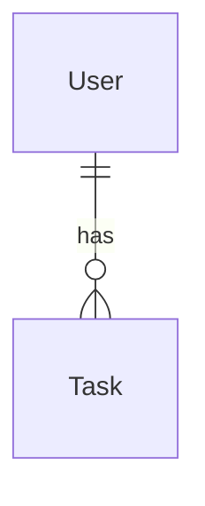

# システム要件

## アーキテクチャ概要

<!-- システム構成図（mermaid 等） -->

## 機能要件（詳細）

<!-- 各機能の入出力、振る舞い -->

### 機能 1

- 入力:
- 処理:
- 出力:

## 非機能要件（詳細）

<!-- 応答時間、可用性、スケーラビリティ -->

| 項目 | 要件 |
| --- | --- |
| 応答時間 | |
| 可用性 | |
| スケーラビリティ | |

## 外部連携

<!-- API、外部サービス -->

## データモデル

<!-- エンティティ、リレーション -->

## 技術スタック

<!-- 使用する技術・フレームワーク -->

| レイヤー | 技術 |
| --- | --- |
| フロントエンド | |
| バックエンド | |
| データベース | |
| インフラ | |
