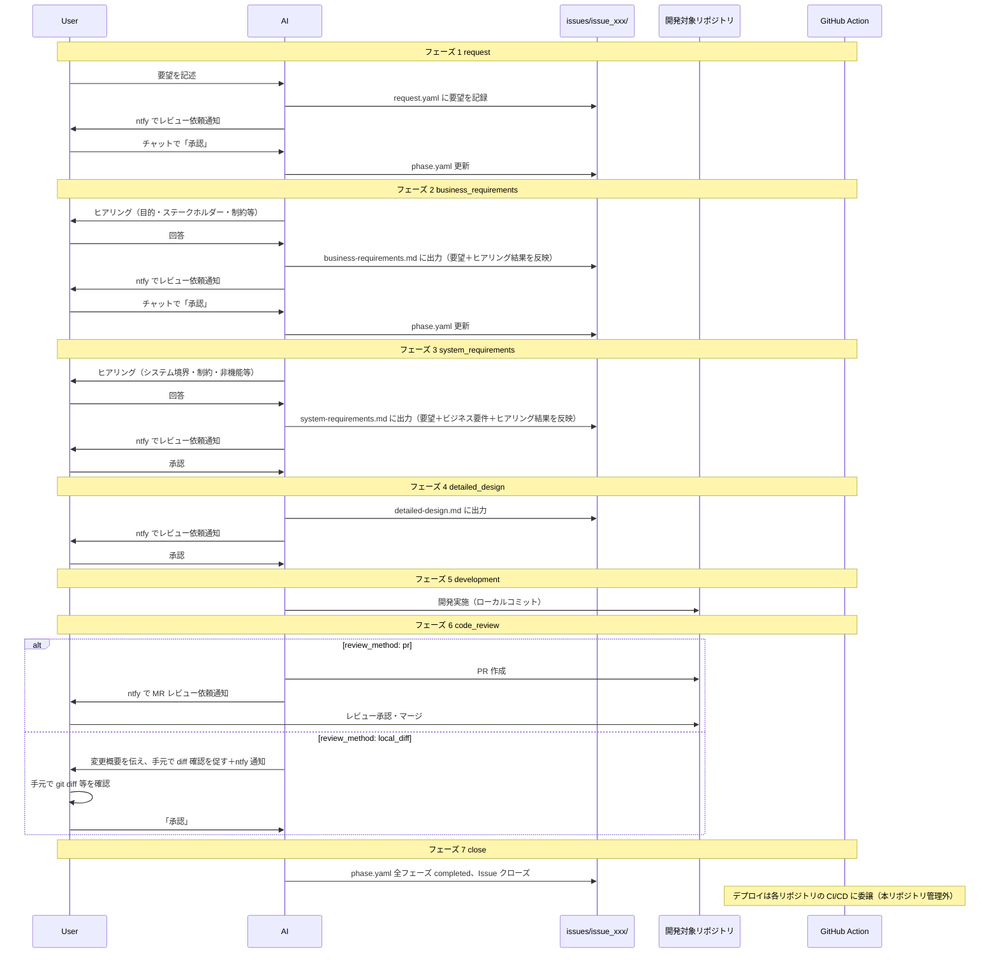

# 開発ワークフロー定義

AI とユーザー間の契約として、フェーズ遷移・承認ルール・差し戻しルールを定義する。

## 最重要ルール: 承認ゲート

**「承認を待つ」= 会話ターンを終了してユーザーの次の発言を待つこと。勝手に次フェーズの作業を始めない。**

- フェーズ 1〜4, 6: 成果物作成後 → ntfy 通知 → 承認を待つ（会話終了）
- フェーズ 5: 承認不要で自動遷移
- フェーズ 7: フェーズ 6 完了後に Issue クローズ

## フロー全体像



## フェーズ定義

| フェーズ | 名前 | 成果物 | 承認方法 |
| --- | --- | --- | --- |
| 1 | request | `request.yaml` | ユーザー承認 |
| 2 | business_requirements | `business-requirements.md`（ヒアリング実施のうえ作成） | ユーザー承認 |
| 3 | system_requirements | `system-requirements.md`（ヒアリング実施のうえ作成） | ユーザー承認 |
| 4 | detailed_design | `detailed-design.md` | ユーザー承認 |
| 5 | development | ローカルコミット | 実装完了で自動遷移 |
| 6 | code_review | PR（pr） or 手元 diff 確認（local_diff） | PR マージ または ユーザー承認 |
| 7 | close | - | PR マージ後クローズ（デプロイは管理外） |

## 承認ルール

### 承認の発言パターン

| パターン | 説明 |
| --- | --- |
| `承認` | 承認待ちが 1 件の場合、その Issue を承認 |
| `OK` / `LGTM` | 同上 |
| `issue_XXX 承認` | 特定の Issue を承認 |

### 承認時の AI の動作

1. `phase.yaml` を更新（フィールド定義・更新ルールは `phase-schema.md` 参照）
2. 次フェーズの作業を開始

## 差し戻しルール

### 差し戻しの発言パターン

| パターン | 説明 |
| --- | --- |
| `差し戻し: [理由]` | 承認待ちが 1 件の場合、その Issue を差し戻し |
| `issue_XXX 差し戻し: [理由]` | 特定の Issue を差し戻し |

### 差し戻し時の AI の動作

1. `phase.yaml` を更新（フィールド定義・更新ルールは `phase-schema.md` 参照）
2. 指摘内容に基づいて成果物を修正
3. 修正後、再度 ntfy で通知
4. `waiting_approval: true` に戻す

## Issue 管理

### 新規 Issue 作成

1. `issues/` 配下の既存ディレクトリをスキャンして次の番号を決定
2. `issues/issue_XXX/` ディレクトリを作成
3. 本スキルの `./assets/` から `request.yaml`, `phase.yaml` をコピー（編集正本は .rulesync 側の assets）
4. 要望を `request.yaml` に記録
5. `phase.yaml` を `current_phase: 1`, `waiting_approval: true`, フェーズ 1 の `status: in_progress` で更新
6. ntfy でレビュー依頼を通知し、**ユーザーの承認を待つ**（承認後にフェーズ 2 へ進む）

### Issue の状態確認

起動時に AI は以下を実行:

1. `issues/` をスキャンして全 Issue を列挙
2. 各 `phase.yaml` から `current_phase` と `waiting_approval` を取得
3. **対象 Issue を決定**（優先順）:
   - ユーザーが `issue_XXX` を指定 → その Issue
   - ユーザーが新規要望を述べている → 「新規 Issue 作成」を実行
   - 承認待ちが 1 件 → その Issue
   - 承認待ちが複数 → 一覧でユーザーに選んでもらう

### Issue のステータス

`phase.yaml` の構造・各フェーズの `status` の取り得る値は `phase-schema.md` を参照。

## 通知ルール

### ntfy 通知タイミング

| フェーズ | タイミング | メッセージ例 |
| --- | --- | --- |
| 1 | 要望記録（request）作成後 | `📋 要望を整理しました（request）。レビューをお願いします` |
| 2 | ビジネス要件作成後 | `📋 ビジネス要件を書きました。レビューをお願いします` |
| 3 | システム要件作成後 | `📋 システム要件を書きました。レビューをお願いします` |
| 4 | 詳細設計作成後 | `📋 詳細設計を書きました。レビューをお願いします` |
| 6 | pr: PR 作成後。local_diff: 実装完了後 | pr: `📋 MR レビュー依頼: [PR URL]` / local_diff: `📋 実装しました。手元で diff を確認してレビューをお願いします` |

### 通知コマンド

```bash
bash scripts/ntfy.sh "📋 メッセージ"
```

## ファイル配置

```
issues/issue_XXX/
├── request.yaml              # 要望
├── phase.yaml                # フェーズ管理
├── business-requirements.md  # ビジネス要件（フェーズ 2）
├── system-requirements.md    # システム要件（フェーズ 3）
└── detailed-design.md        # 詳細設計（フェーズ 4）
```

## 開発対象リポジトリとの連携

- `request.yaml` の `project_ids` に列挙した id と一致する `config/projects.yaml` の要素の `path` が、この Issue で扱うリポジトリ全体。
- フェーズ 5（development）: 列挙した**すべての**リポジトリで実装。
- フェーズ 6（code_review）: レビュー方法はプロジェクトの `review_method`（必須）に従う（下記）。
- デプロイ設定は開発対象リポジトリ側に配置

### config/projects.yaml の項目

| キー | 必須 | 説明 |
| --- | --- | --- |
| `id` | ○ | request.yaml の `project_ids` で参照する識別子。 |
| `name` | ○ | プロジェクト名（表示・メモ用）。 |
| `path` | ○ | リポジトリのローカルパス。この Issue で扱う実体。 |
| `repo` | ○ | リモートリポジトリ（例: `github.com/user/repo`）。 |
| `default_branch` | ○ | デフォルトブランチ（例: `main`, `master`）。 |
| `review_method` | ○ | フェーズ 6 のレビュー方法。`pr` または `local_diff`。 |
| → `pr` | | AI が push して PR を作成。マージ後にクローズ。 |
| → `local_diff` | | PR は作らない。ユーザーが手元で diff を確認して承認。AI の git 操作が禁止されている場合に指定。 |
| `notes` | - | 自由記述のメモ。 |
