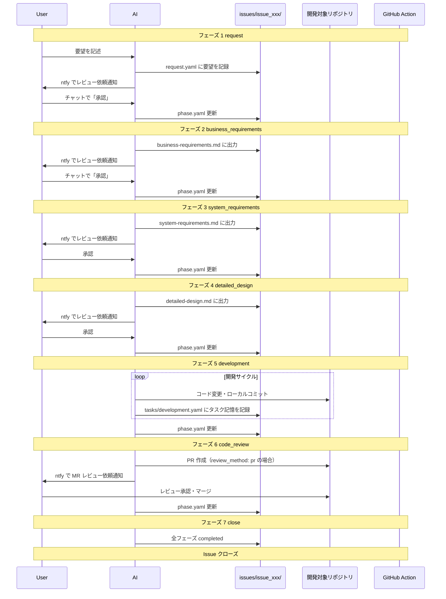

# ai-workspace

AI エージェント設定（rules, skills, subagents, commands, MCP）を一元管理し、複数のエージェント（Cursor, Claude Code, Codex CLI）に展開する基盤リポジトリ。

## 概要

このリポジトリは以下を提供する：

- **AI エージェント設定の一元管理** - `.rulesync/` を編集正本として、複数のエージェント用設定を自動生成
- **スキルセット** - 開発ワークフロー、コード調査、スキル作成など、実践的なスキル群
- **サブエージェント** - アーキテクト、コードレビュアー、TDDガイドなど、専門タスク用エージェント
- **プロジェクト横断管理** - `config/projects.yaml` で複数の開発対象リポジトリを管理

## リポジトリ構成

```
ai-workspace/
├── config/                     # 設定ファイル
│   ├── settings.yaml           # 通知設定（git 管理外）
│   └── projects.yaml           # 開発対象リポジトリ一覧（git 管理外）
├── issues/                     # Issue 単位の成果物（git 管理外）
│   └── {issue-id}/
│       ├── request.yaml
│       ├── phase.yaml
│       ├── business-requirements.md
│       ├── system-requirements.md
│       ├── detailed-design.md
│       └── tasks/
├── .rulesync/                  # AI エージェント設定の編集正本
│   ├── rules/                  # ルール定義
│   ├── skills/                 # スキル定義（dev-workflow, investigation-report, skill-creator）
│   ├── subagents/              # サブエージェント定義（architect, code-reviewer, tdd-guide など）
│   ├── commands/               # カスタムコマンド（investigate, learn, plan）
│   └── mcp.json                # MCP サーバー設定（git 管理外）
├── .cursor/                    # Cursor 用（rulesync で自動生成・git 管理外）
├── .claude/                    # Claude Code 用（rulesync で自動生成・git 管理外）
├── .codex/                     # Codex CLI 用（rulesync で自動生成・git 管理外）
├── scripts/                    # ユーティリティスクリプト
├── AGENTS.md                   # エージェント設定（rulesync で自動生成・git 管理外）
├── CLAUDE.md                   # Claude 設定（rulesync で自動生成・git 管理外）
└── rulesync.jsonc              # rulesync 設定
```

**重要**: `.rulesync/` が編集正本。変更後は `rulesync generate` で各エージェント用設定を展開すること。

## dev-workflow スキル

Issue 単位の開発ワークフロー（要望→要件→設計→実装→レビュー→クローズ）を管理するスキル。

### フェーズ定義

| フェーズ | 名前 | 説明 |
| --- | --- | --- |
| 1 | request | 要望を `request.yaml` に記録 → ntfy 通知 → 承認で次へ |
| 2 | business_requirements | **ヒアリング** → ビジネス要件を作成 → ntfy 通知 → 承認で次へ |
| 3 | system_requirements | **ヒアリング** → システム要件を作成 → ntfy 通知 → 承認で次へ |
| 4 | detailed_design | 詳細設計を作成 → ntfy 通知 → 承認で次へ |
| 5 | development | 設計に基づき実装。タスク記憶（`tasks/development.yaml`）を更新しながら進行 |
| 6 | code_review | `review_method` に応じて PR または手元 diff でレビュー → 承認で次へ |
| 7 | close | 全フェーズ完了 → Issue クローズ |

### フロー図



## スキルとサブエージェント

### 利用可能なスキル

| スキル | 説明 | 使用タイミング |
| --- | --- | --- |
| **dev-workflow** | Issue 単位の開発フロー管理 | 新規要望、Issue 進行、承認・差し戻し時 |
| **investigation-report** | コード調査レポート作成 | 既存機能調査、バグ原因特定、パフォーマンス分析時 |
| **skill-creator** | スキル作成支援 | 新しいスキルを作成する時 |

### 利用可能なサブエージェント

| サブエージェント | 説明 | 使用タイミング |
| --- | --- | --- |
| **architect** | システム設計・アーキテクチャ判断 | 新機能計画、大規模リファクタリング時 |
| **code-investigator** | コード調査・分析 | バグ調査、機能理解、データ整合性確認時 |
| **code-reviewer** | コードレビュー | コード変更後の品質・セキュリティ確認 |
| **planner** | タスク計画 | 複雑なタスクの分解・計画時 |
| **security-reviewer** | セキュリティレビュー | セキュリティ上の懸念がある変更時 |
| **tdd-guide** | テスト駆動開発支援 | 新機能・バグ修正・リファクタリング時 |

### カスタムコマンド

| コマンド | 説明 |
| --- | --- |
| **/investigate** | コードベースの調査を開始 |
| **/learn** | 既存コードから学習 |
| **/plan** | タスクの計画を立案 |

## セットアップ

```bash
# 1. クローン
git clone https://github.com/your-username/ai-workspace.git
cd ai-workspace

# 2. 設定ファイル作成
cp config/settings.yaml.example config/settings.yaml
cp config/projects.yaml.example config/projects.yaml
cp .env.example .env  # MCP使用時のみ
cp .rulesync/mcp.json.example .rulesync/mcp.json  # MCP使用時のみ

# 3. エージェント設定の生成
brew install rulesync
rulesync generate

# 4. 通知テスト
bash scripts/ntfy.sh "テスト通知"
```

### 設定ファイル

- **config/settings.yaml** - ntfy トピック設定
- **config/projects.yaml** - 開発対象リポジトリ一覧（詳細は [config リファレンス](.rulesync/skills/dev-workflow/references/config-reference.md)）
- **.env** - MCP サーバーのトークン（任意）
- **.rulesync/mcp.json** - MCP サーバー設定（任意）

## 使い方

### dev-workflow: 新規 Issue を開始

```
ユーザー: タスク管理アプリを作りたい。スマホから使えてシンプルなもの
AI: issues/issue_001_task_app/ を作成しました。レビューをお願いします（ntfy で通知）
```

### dev-workflow: 承認・差し戻し

```bash
# 承認
承認

# 差し戻し
issue_001_task_app 差し戻し: 機能要件に通知機能を追加して
```

### dev-workflow: Issue の進行状況確認

```
ユーザー: Issue の状況を教えて
AI: - issue_001_task_app: フェーズ 3 (system_requirements) - 承認待ち
    - issue_002_add_notification: フェーズ 5 (development) - 進行中
```

### その他のスキル

他のスキル（investigation-report, skill-creator など）は、トリガーワードやコンテキストで自動起動します。詳細は [スキル詳細](.rulesync/skills/) を参照。

## リファレンス

- [フェーズ詳細とヒアリングガイド](.rulesync/skills/dev-workflow/references/phases-detail.md)
- [projects.yaml 設定リファレンス](.rulesync/skills/dev-workflow/references/config-reference.md)
- [スキーマ定義](.rulesync/skills/dev-workflow/references/schemas/)
- [スキル詳細](.rulesync/skills/)
