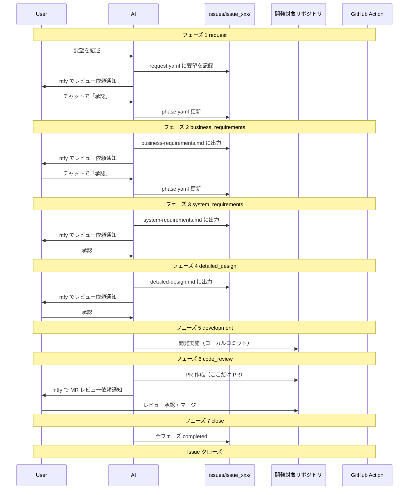

# ai-workspace

- AIとのワークフローを管理する基盤リポジトリ

## コンセプト

### 課題感

- 仕様駆動開発（cc-sdd, OpenSpec など）のワークフローは存在するが、チーム開発での導入・運用コストを考えると実践しづらい
- メインスレッドを切り替えると AI のコンテキストが消失する。ドメイン知識や設計内容は skills で復帰しやすい一方で、個別タスクの進捗・コンテキストの維持が難しい

### このリポジトリが解決すること

- Issue 単位でワークフローと成果物（要件・設計など）を集約
- フェーズ管理（`phase.yaml`）によりコンテキストを永続化し、セッション切れからの復旧を容易に
- 開発に限らず、調査・相談などのワークフローも同じ仕組みで扱える

## 責務と棲み分け

```
dotfiles (汎用 agent 設定)
└── skills, rules, hooks
    ├── どのリポジトリでも使う共通設定
    └── 基盤リポジトリを介さず直接開発するとき用

ai-workspace (基盤リポジトリ)
└── 開発・調査・相談など Issue 単位のフロー
    ├── ワークフロー専用 skills / rules
    ├── issues/ (作業中の成果物)
    └── config/ (対象リポジトリ指定)
```

| 場所 | 置くもの |
| --- | --- |
| dotfiles | どのリポジトリでも使う汎用 agent 設定（skills, rules, hooks） |
| ai-workspace | Issue 単位のワークフロー、開発対象リポジトリごとの config、成果物（要件・設計など） |
| 開発対象リポジトリ | コード本体。`config/projects.yaml` で path を指定（複数可） |

## リポジトリ構成

```
ai-workspace/
├── README.md
├── config/
│   ├── settings.yaml           # 通知設定など（git 管理外）
│   ├── settings.yaml.example   # settings.yaml のテンプレート
│   └── projects.yaml           # 開発対象リポジトリ一覧（project_ids で参照）
├── issues/                     # git 管理外（.gitignore）
│   └── issue_001_task_app/    # id は issue_NNN_slug
│       ├── request.yaml
│       ├── phase.yaml
│       ├── business-requirements.md
│       ├── system-requirements.md
│       ├── detailed-design.md
│       └── tasks/
│           └── development.yaml  # 開発タスク記憶（フェーズ 5）
├── scripts/
│   └── ntfy.sh                 # ntfy 通知送信
├── rulesync.jsonc              # rulesync 設定ファイル
├── .rulesync/                  # rulesync の編集正本（ここを編集して rulesync generate）
│   ├── rules/                  # プロジェクトルール（CLAUDE.md / AGENTS.md の元）
│   │   └── overview.md
│   └── skills/
│       └── dev-workflow/       # 開発ワークフロー
│           ├── SKILL.md
│           ├── references/     # フェーズ定義・スキーマ・ヒアリングガイド
│           └── assets/         # 成果物ひな形
├── AGENTS.md                   # rulesync 生成（git 管理外）
├── CLAUDE.md                   # rulesync 生成（git 管理外）
├── .cursor/                    # rulesync で展開（Cursor 用・git 管理外）
│   ├── rules/
│   └── skills/dev-workflow/
├── .claude/                    # rulesync で展開（Claude Code 用・git 管理外）
│   └── skills/dev-workflow/
└── .codex/                     # rulesync で展開（Codex 用・git 管理外）
    └── skills/dev-workflow/
```

## 開発フロー



### フェーズ定義

| フェーズ | 名前 | 説明 |
| --- | --- | --- |
| 1 | request | 要望を `request.yaml` に記録 → ntfy 通知 → 承認で次へ |
| 2 | business_requirements | ヒアリング → ビジネス要件を作成 → ntfy 通知 → 承認で次へ |
| 3 | system_requirements | ヒアリング → システム要件を作成 → ntfy 通知 → 承認で次へ |
| 4 | detailed_design | 詳細設計を作成 → ntfy 通知 → 承認で次へ |
| 5 | development | 設計に基づき実装。タスク記憶を更新しながら進行。ローカルコミット |
| 6 | code_review | `review_method` に応じて PR または手元 diff でレビュー → 承認で次へ |
| 7 | close | 全フェーズ完了 → Issue クローズ（デプロイは各プロダクトの CI/CD に委任） |

### なぜフェーズを分けるのか

- **PR はコードレビュー時のみ**: 要件・設計はローカルファイルで管理し、ノイズを減らす
- **成果物出力 → ntfy → 承認のサイクル**: スマホから SSH して「承認」と言うだけで次へ進める
- **仕様を固めてから実装**: 1 Issue = 1 開発サイクルとして履歴を残す
- **ヒアリングで認識を合わせる**: フェーズ 2,3 でユーザーの意図を確認してから成果物を作成
- **タスク記憶でコンテキスト維持**: フェーズ 5 では `tasks/development.yaml` に進捗を記録し、セッション切れ後も復帰可能

## セットアップ

### 1. リポジトリをクローン

```bash
git clone https://github.com/your-username/ai-workspace.git
cd ai-workspace
```

### 2. 設定ファイルを作成

```bash
cp config/settings.yaml.example config/settings.yaml
```

`config/settings.yaml` を編集して ntfy トピックを設定:

```yaml
ntfy:
  server: "https://ntfy.sh"
  topic: "your-secret-topic"
  # token: "..."   # 認証が必要な場合のみ
```

- `config/settings.yaml` は git にコミットしないでください。
- 従来の `config/settings.yaml.template`（`ntfy_topic` / `ntfy_base_url`）は別形式のため、本スクリプトでは `settings.yaml.example` の形式を使用します。

### 3. 開発対象プロジェクトを設定

`config/projects.yaml` を編集（各 Issue の `request.yaml` の `project_ids` で id を参照）:

```yaml
projects:
  - id: ai-workspace
    name: "ai-workspace"
    path: "~/environment/ai-workspace"
    repo: "github.com/kuroweb/ai-workspace"
    default_branch: master
    review_method: local_diff   # pr または local_diff
    notes: |
      - ai-workspace 開発用プロジェクト
  - id: my-app
    name: "マイアプリ"
    path: "/path/to/my-app"
    repo: "github.com/user/my-app"
    default_branch: main
    review_method: pr           # pr または local_diff
    notes: |
      - アプリ本体リポジトリ
```

| 項目 | 説明 |
| --- | --- |
| `review_method: pr` | AI が PR を作成し、GitHub 上でレビュー |
| `review_method: local_diff` | AI は push せず、手元で `git diff` を確認してレビュー |

### 4. ntfy の設定

1. スマホに [ntfy](https://ntfy.sh) アプリをインストール
2. `config/settings.yaml` の `ntfy.topic` と同じトピックを購読
3. 動作確認:

```bash
bash scripts/ntfy.sh "テスト通知"
```

### 5. rulesync でエージェント用設定を生成（任意）

Cursor / Claude Code / Codex でこのリポジトリを開く場合、以下でルールとスキルを展開する。

```bash
rulesync generate
```

生成される `AGENTS.md`, `CLAUDE.md`, `.cursor/`, `.claude/`, `.codex/` は `.gitignore` 済み。編集する場合は `.rulesync/rules/` と `.rulesync/skills/` を変更してから再度 `rulesync generate` を実行する。

## 使い方

### 新規 Issue を開始

AI との会話で要望を伝えると、AI が `issues/issue_NNN_slug/` を作成してフローを開始する。スラッグは要望から自動生成される。

```
ユーザー: タスク管理アプリを作りたい。スマホから使えてシンプルなもの。
AI: issues/issue_001_task_app/ を作成し、request.yaml に要望を記録しました。レビューをお願いします。（ntfy で通知）
    [ユーザーが「承認」後] ビジネス要件を作成しています...
```

### 承認・差し戻し

ntfy 通知を受けたら、チャットで承認または差し戻しを伝える。

```
# 承認（承認待ちが 1 件の場合）
ユーザー: 承認

# 特定の Issue を承認（id で指定）
ユーザー: issue_001_task_app 承認

# 差し戻し
ユーザー: issue_001_task_app 差し戻し: 機能要件に通知機能を追加して
```

### Issue の進行状況確認

```
ユーザー: Issue の状況を教えて
AI: issues/ をスキャンします...
    - issue_001_task_app: フェーズ 3 (system_requirements) - 承認待ち
    - issue_002_add_notification: フェーズ 5 (development) - 進行中
```

## issues/ の扱い

| 方針 | 説明 |
| --- | --- |
| **git 管理外** | `.gitignore` で除外。個人的・機密的な内容を含むため |
| **ローカルのみ** | 作業中の要件・設計は ai-workspace のローカルに保存 |
| **ナレッジの永続化** | 終了した Issue から学びを抽出し、別のデータソースに保存可能 |
| **公開可能** | issues/ を除外すればリポジトリ自体は public 可 |

## ファイルスキーマ

### issues/<issue_id>/request.yaml

```yaml
id: issue_001_task_app
project_ids: [my-project]
title: "タスク管理アプリを作りたい"
created_at: "2026-02-14T10:30:00+09:00"
raw_input: |
  スマホから使えるシンプルなタスク管理アプリを作りたい。
  - タスクの追加・完了・削除
  - 期限設定
  - ntfy で期限通知
```

### issues/<issue_id>/phase.yaml

```yaml
current_phase: 2
waiting_approval: true

phases:
  1:
    name: "request"
    status: "completed"
  2:
    name: "business_requirements"
    status: "in_progress"
    output: "business-requirements.md"
    rejection_reason: null
  3:
    name: "system_requirements"
    status: "pending"
    output: "system-requirements.md"
  # ... 以降のフェーズ
```

## 通知方式

- 基本は **ntfy**（`scripts/ntfy.sh`）
- フェーズ 1〜4: 成果物のローカルパスを案内（フェーズ 1 は request.yaml のレビュー依頼）
- フェーズ 6: `review_method` に応じて PR URL または手元 diff の確認依頼

```bash
# フェーズ 1（request）
bash scripts/ntfy.sh "📋 要望を整理しました（request）。レビューをお願いします"

# フェーズ 2〜4
bash scripts/ntfy.sh "📋 ビジネス要件を書きました。レビューをお願いします"

# フェーズ 6（review_method: pr）
bash scripts/ntfy.sh "📋 MR レビュー依頼: https://github.com/user/repo/pull/123"

# フェーズ 6（review_method: local_diff）
bash scripts/ntfy.sh "📋 実装しました。手元で diff を確認してレビューをお願いします"
```

## dotfiles との連携

- **rulesync**: ai-workspace でも rulesync を使い、複数 Agent（Cursor, Claude Code, Codex など）で設定を共有
- **編集正本**: `.rulesync/` が編集正本。`rulesync generate` で以下を生成する（いずれも `.gitignore` 対象）
  - **rules**: `AGENTS.md`, `CLAUDE.md`, `.cursor/rules/` など（正本は `.rulesync/rules/`）
  - **skills**: `.cursor/skills/`, `.claude/skills/`, `.codex/skills/`（正本は `.rulesync/skills/`）
- **初回・クローン後**: `rulesync generate` を実行すると各エージェント用の設定が生成される
- **定期的な移植**: ai-workspace で育てた skills / rules のうち汎用的なものは dotfiles へ移行
- **context-load**: skills に「指定した issue_id（例: issue_001_task_app）を読み込んでコンテキストを復元する」処理を実装
