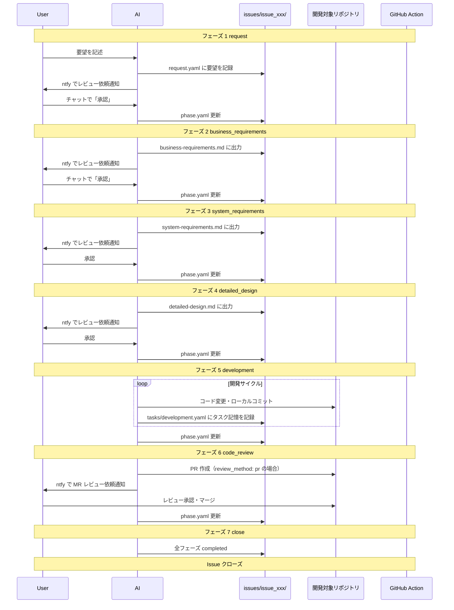

# ai-workspace

- AIとのワークフローを管理する基盤リポジトリ

## コンセプト

### 課題感

- 仕様駆動開発（cc-sdd, OpenSpec など）のワークフローは存在するが、チーム開発での導入・運用コストを考えると実践しづらい
- メインスレッドを切り替えると AI のコンテキストが消失する。ドメイン知識や設計内容は skills で復帰しやすい一方で、個別タスクの進捗・コンテキストの維持が難しい

### このリポジトリが解決すること

- Issue 単位でワークフローと成果物（要件・設計など）を集約
- フェーズ管理（`phase.yaml`）によりコンテキストを永続化し、セッション切れからの復旧を容易に
- 開発に限らず、調査・相談などのワークフローも同じ仕組みで扱える

## 責務と棲み分け

```
dotfiles (汎用 agent 設定)
└── skills, rules, hooks
    ├── どのリポジトリでも使う共通設定
    └── 基盤リポジトリを介さず直接開発するとき用

ai-workspace (基盤リポジトリ)
└── 開発・調査・相談など Issue 単位のフロー
    ├── ワークフロー専用 skills / rules
    ├── issues/ (作業中の成果物)
    └── config/ (対象リポジトリ指定)
```

| 場所 | 置くもの |
| --- | --- |
| dotfiles | どのリポジトリでも使う汎用 agent 設定（skills, rules, hooks） |
| ai-workspace | Issue 単位のワークフロー、開発対象リポジトリごとの config、成果物（要件・設計など） |
| 開発対象リポジトリ | コード本体。`config/projects.yaml` で path を指定（複数可） |

## リポジトリ構成

```
ai-workspace/
├── README.md
├── config/
│   ├── settings.yaml           # 通知設定など（git 管理外）
│   ├── settings.yaml.example   # settings.yaml のテンプレート
│   ├── projects.yaml           # 開発対象リポジトリ一覧（git 管理外）
│   └── projects.yaml.example   # projects.yaml のテンプレート
├── issues/                     # git 管理外（.gitignore）
│   └── issue_001_task_app/    # id は issue_NNN_slug
│       ├── request.yaml       # 要望記録（スキーマ: schemas/request-schema.md）
│       ├── phase.yaml         # フェーズ管理（スキーマ: schemas/phase-schema.md）
│       ├── business-requirements.md
│       ├── system-requirements.md
│       ├── detailed-design.md
│       └── tasks/
│           └── development.yaml  # 開発タスク記憶（フェーズ 5、スキーマ: schemas/tasks-schema.md）
├── scripts/
│   ├── ntfy.sh                 # ntfy 通知送信
│   └── start-esa-mcp.sh        # esa MCP サーバー起動スクリプト
├── .env                        # 環境変数（git 管理外）
├── .env.example                # 環境変数テンプレート
├── rulesync.jsonc              # rulesync 設定ファイル
├── .rulesync/                  # rulesync の編集正本（ここを編集して rulesync generate）
│   ├── mcp.json                # MCP 設定（git 管理外）
│   ├── mcp.json.example        # MCP 設定テンプレート
│   ├── rules/                  # プロジェクトルール（CLAUDE.md / AGENTS.md の元）
│   │   ├── overview.md         # ai-workspace 概要
│   │   └── git-command.md      # git コマンド実行制限ルール
│   └── skills/
│       ├── dev-workflow/       # 開発ワークフロー
│       │   ├── SKILL.md
│       │   ├── references/     # フェーズ定義・スキーマ・config リファレンス
│       │   │   ├── phases-detail.md
│       │   │   ├── config-reference.md
│       │   │   └── schemas/
│       │   │       ├── request-schema.md
│       │   │       ├── phase-schema.md
│       │   │       └── tasks-schema.md
│       │   └── assets/         # 成果物ひな形
│       │       ├── request.yaml
│       │       ├── phase.yaml
│       │       ├── business-requirements.md
│       │       ├── system-requirements.md
│       │       └── detailed-design.md
│       └── ps-coupon-project/  # プロジェクト固有スキル例
│           ├── SKILL.md
│           └── references/
├── AGENTS.md                   # rulesync 生成（git 管理外）
├── CLAUDE.md                   # rulesync 生成（git 管理外）
├── .cursor/                    # rulesync で展開（Cursor 用・git 管理外）
│   ├── rules/
│   └── skills/
├── .claude/                    # rulesync で展開（Claude Code 用・git 管理外）
│   └── skills/
└── .codex/                     # rulesync で展開（Codex 用・git 管理外）
    └── skills/
```

## 開発フロー



### フェーズ定義

| フェーズ | 名前 | 説明 |
| --- | --- | --- |
| 1 | request | 要望を `request.yaml` に記録 → ntfy 通知 → 承認で次へ |
| 2 | business_requirements | **ヒアリング** → ビジネス要件を作成 → ntfy 通知 → 承認で次へ |
| 3 | system_requirements | **ヒアリング** → システム要件を作成 → ntfy 通知 → 承認で次へ |
| 4 | detailed_design | 詳細設計を作成 → ntfy 通知 → 承認で次へ |
| 5 | development | 設計に基づき実装。タスク記憶（`tasks/development.yaml`）を更新しながら進行。git 操作は `git_command` 設定に従う |
| 6 | code_review | `review_method` に応じて PR または手元 diff でレビュー → 承認で次へ |
| 7 | close | 全フェーズ完了 → Issue クローズ（デプロイは各プロダクトの CI/CD に委任） |

### なぜフェーズを分けるのか

- **PR はコードレビュー時のみ**: 要件・設計はローカルファイルで管理し、ノイズを減らす
- **成果物出力 → ntfy → 承認のサイクル**: スマホから SSH して「承認」と言うだけで次へ進める
- **仕様を固めてから実装**: 1 Issue = 1 開発サイクルとして履歴を残す
- **ヒアリングで認識を合わせる**: フェーズ 2,3 でユーザーの意図を確認してから成果物を作成（各フェーズで 1〜3 問程度）
- **タスク記憶でコンテキスト維持**: フェーズ 5 では `tasks/development.yaml` に進捗を記録し、セッション切れ後も復帰可能
- **git 操作の制御**: `git_command` 設定により、AI による git コマンド実行の可否を制御可能（詳細は後述）

## セットアップ

### 1. リポジトリをクローン

```bash
git clone https://github.com/your-username/ai-workspace.git
cd ai-workspace
```

### 2. 設定ファイルを作成

```bash
# 必須: 通知設定とプロジェクト設定
cp config/settings.yaml.example config/settings.yaml
cp config/projects.yaml.example config/projects.yaml

# 任意: MCP サーバー設定（esa 連携など）
cp .env.example .env
cp .rulesync/mcp.json.example .rulesync/mcp.json
```

各ファイルを環境に合わせて編集:

- `config/settings.yaml`: ntfy トピックを設定
- `config/projects.yaml`: 開発対象リポジトリを設定（詳細は後述）
- `.env`: MCP サーバーのトークン（任意）

### 3. プロジェクト設定

`config/projects.yaml` で開発対象リポジトリを定義する

```yaml
projects:
  - id: my-app
    name: "マイアプリ"
    path: "/path/to/my-app"
    repo: "github.com/user/my-app"
    default_branch: main
    git_command: disabled       # AI の git コマンド実行を制御
    review_method: local_diff   # レビュー方法
    notes: "プロジェクトのメモ"
```

**主要な設定項目:**

- `git_command`: `enabled` で AI が git 操作可能、`disabled` でファイル編集のみ（デフォルト: `disabled`）
- `review_method`: `pr` で PR 作成、`local_diff` で手元レビュー（`git_command: disabled` なら `local_diff` 必須）

詳細は [config リファレンス](.rulesync/skills/dev-workflow/references/config-reference.md) を参照

### 4. 通知設定の確認

```bash
bash scripts/ntfy.sh "テスト通知"
```

スマホの [ntfy](https://ntfy.sh) アプリで `config/settings.yaml` のトピックを購読すること

### 5. エージェント設定の生成（任意)

Cursor / Claude Code / Codex で開く場合、ルールとスキルを展開すること

```bash
rulesync generate
```

編集する場合は `.rulesync/` 配下を変更してから再度 `rulesync generate` を実行すること

## 使い方

### 新規 Issue を開始

`/dev-workflow` を送信してスキルを起動し、要望を伝えると Issue を作成してフローを開始

```
ユーザー: /dev-workflow
        タスク管理アプリを作りたい。スマホから使えてシンプルなもの
AI: issues/issue_001_task_app/ を作成しました。レビューをお願いします（ntfy で通知）
```

または、直接要望を伝えると AI が自動的にスキルを起動する

### 承認・差し戻し

ntfy 通知を受けたら、チャットで応答すること

```bash
# 承認
承認

# 特定の Issue を指定して承認
issue_001_task_app 承認

# 差し戻し
issue_001_task_app 差し戻し: 機能要件に通知機能を追加して
```

**ヒアリングについて**: フェーズ 2, 3 では成果物作成前に 1〜3 問のヒアリングを行う

### Issue の進行状況確認

```
ユーザー: Issue の状況を教えて
AI: - issue_001_task_app: フェーズ 3 (system_requirements) - 承認待ち
    - issue_002_add_notification: フェーズ 5 (development) - 進行中
```

## issues/ の扱い

- **git 管理外**: 個人的・機密的な内容を含むため `.gitignore` で除外
- **ナレッジの永続化**: 終了した Issue から学びを抽出し、別のデータソースに保存可能

## ファイルスキーマ

詳細は `.rulesync/skills/dev-workflow/references/schemas/` を参照。

### request.yaml

```yaml
id: issue_001_task_app
project_ids: [my-project]
title: "タスク管理アプリを作りたい"
created_at: "2026-02-14T10:30:00+09:00"
raw_input: |
  スマホから使えるシンプルなタスク管理アプリを作りたい。
```

[スキーマ詳細](.rulesync/skills/dev-workflow/references/schemas/request-schema.md)

### phase.yaml

```yaml
current_phase: 2
waiting_approval: true
phases:
  1:
    name: "request"
    status: "completed"
  2:
    name: "business_requirements"
    status: "in_progress"
```

[スキーマ詳細](.rulesync/skills/dev-workflow/references/schemas/phase-schema.md)

### tasks/development.yaml

フェーズ 5 でのタスク進捗を記録。[スキーマ詳細](.rulesync/skills/dev-workflow/references/schemas/tasks-schema.md)

## 通知方式

基本は ntfy（`scripts/ntfy.sh`）。フェーズ 1〜4 は成果物のパス、フェーズ 6 は PR URL または diff 確認依頼を通知。

```bash
# フェーズ 1〜4
bash scripts/ntfy.sh "📋 ビジネス要件を書きました。レビューをお願いします"

# フェーズ 6 (review_method: pr)
bash scripts/ntfy.sh "📋 MR レビュー依頼: https://github.com/user/repo/pull/123"

# フェーズ 6 (review_method: local_diff)
bash scripts/ntfy.sh "📋 実装しました。手元で diff を確認してレビューをお願いします"
```

## dotfiles との連携

- **rulesync**: ai-workspace でも rulesync を使い、複数 Agent（Cursor, Claude Code, Codex など）で設定を共有
- **編集正本**: `.rulesync/` が編集正本。`rulesync generate` で以下を生成する（いずれも `.gitignore` 対象）
  - **rules**: `AGENTS.md`, `CLAUDE.md`, `.cursor/rules/` など（正本は `.rulesync/rules/`）
  - **skills**: `.cursor/skills/`, `.claude/skills/`, `.codex/skills/`（正本は `.rulesync/skills/`）
- **初回・クローン後**: `rulesync generate` を実行すると各エージェント用の設定が生成される
- **定期的な移植**: ai-workspace で育てた skills / rules のうち汎用的なものは dotfiles へ移行

## MCP サーバー連携（任意）

MCP（Model Context Protocol）サーバーで外部サービスと連携できます。

### 設定手順

1. `.env.example` から `.env` を作成してトークンを設定
2. `.rulesync/mcp.json.example` から `.rulesync/mcp.json` を作成
3. `rulesync generate` で各エージェント用に展開

### esa MCP サーバー

esa.io の記事を AI から参照・検索できます。

```bash
# .env
ESA_ACCESS_TOKEN="your-esa-token"

# 起動（通常は自動起動）
bash scripts/start-esa-mcp.sh
```

設定: `.rulesync/mcp.json`

```json
{
  "mcpServers": {
    "esa": {
      "command": "./scripts/start-esa-mcp.sh",
      "args": [],
      "alwaysAllow": ["esa_get_post"]
    }
  }
}
```

### カスタム MCP サーバーの追加

1. 起動スクリプトを `scripts/` に配置
2. `.rulesync/mcp.json` に設定を追加
3. `rulesync generate` で展開

詳細: [MCP 公式ドキュメント](https://modelcontextprotocol.io/)

## リファレンス

### フェーズ詳細

- [フェーズ詳細とヒアリングガイド](.rulesync/skills/dev-workflow/references/phases-detail.md)

### スキーマ定義

- [request.yaml](.rulesync/skills/dev-workflow/references/schemas/request-schema.md)
- [phase.yaml](.rulesync/skills/dev-workflow/references/schemas/phase-schema.md)
- [tasks/development.yaml](.rulesync/skills/dev-workflow/references/schemas/tasks-schema.md)

### config 設定

- [projects.yaml 設定リファレンス](.rulesync/skills/dev-workflow/references/config-reference.md)
