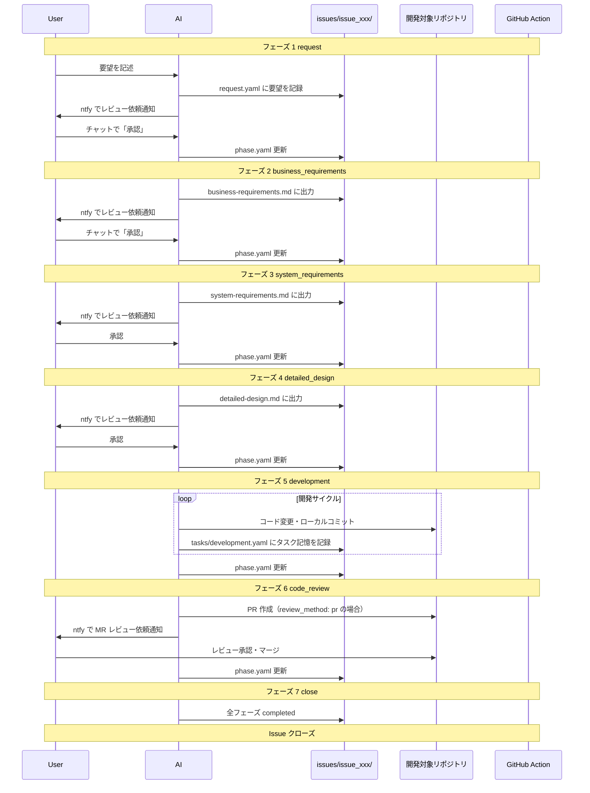

# ai-workspace

- AIとのワークフローを管理する基盤リポジトリ

## コンセプト

### 課題感

- 仕様駆動開発（cc-sdd, OpenSpec など）のワークフローは存在するが、チーム開発での導入・運用コストを考えると実践しづらい
- メインスレッドを切り替えると AI のコンテキストが消失する。ドメイン知識や設計内容は skills で復帰しやすい一方で、個別タスクの進捗・コンテキストの維持が難しい

### このリポジトリが解決すること

- Issue 単位でワークフローと成果物（要件・設計など）を集約
- フェーズ管理（`phase.yaml`）によりコンテキストを永続化し、セッション切れからの復旧を容易に
- 開発に限らず、調査・相談などのワークフローも同じ仕組みで扱える
- AI エージェント設定（rules, skills, subagents, commands, MCP）を一元管理し、複数のエージェント（Cursor, Claude Code, Codex CLI）に展開

**注**: 以前は dotfiles で管理していた AI 関連ファイルを ai-workspace に統合しました。

## リポジトリ構成

```
ai-workspace/
├── config/                     # 設定ファイル
│   ├── settings.yaml           # 通知設定（git 管理外）
│   └── projects.yaml           # 開発対象リポジトリ一覧（git 管理外）
├── issues/                     # Issue 単位の成果物（git 管理外）
│   └── {issue-id}/
│       ├── request.yaml
│       ├── phase.yaml
│       ├── business-requirements.md
│       ├── system-requirements.md
│       ├── detailed-design.md
│       └── tasks/
├── .rulesync/                  # AI エージェント設定の編集正本
│   ├── rules/                  # ルール定義
│   ├── skills/                 # スキル定義（dev-workflow, investigation-report, skill-creator）
│   ├── subagents/              # サブエージェント定義（architect, code-reviewer, tdd-guide など）
│   ├── commands/               # カスタムコマンド（investigate, learn, plan）
│   └── mcp.json                # MCP サーバー設定（git 管理外）
├── .cursor/                    # Cursor 用（rulesync で自動生成・git 管理外）
├── .claude/                    # Claude Code 用（rulesync で自動生成・git 管理外）
├── .codex/                     # Codex CLI 用（rulesync で自動生成・git 管理外）
├── scripts/                    # ユーティリティスクリプト
├── AGENTS.md                   # エージェント設定（rulesync で自動生成・git 管理外）
├── CLAUDE.md                   # Claude 設定（rulesync で自動生成・git 管理外）
└── rulesync.jsonc              # rulesync 設定
```

**重要**: `.rulesync/` が編集正本。変更後は `rulesync generate` で各エージェント用設定を展開すること。

## 開発フロー



### フェーズ定義

| フェーズ | 名前 | 説明 |
| --- | --- | --- |
| 1 | request | 要望を `request.yaml` に記録 → ntfy 通知 → 承認で次へ |
| 2 | business_requirements | **ヒアリング** → ビジネス要件を作成 → ntfy 通知 → 承認で次へ |
| 3 | system_requirements | **ヒアリング** → システム要件を作成 → ntfy 通知 → 承認で次へ |
| 4 | detailed_design | 詳細設計を作成 → ntfy 通知 → 承認で次へ |
| 5 | development | 設計に基づき実装。タスク記憶（`tasks/development.yaml`）を更新しながら進行。git 操作は `git_command` 設定に従う |
| 6 | code_review | `review_method` に応じて PR または手元 diff でレビュー → 承認で次へ |
| 7 | close | 全フェーズ完了 → Issue クローズ（デプロイは各プロダクトの CI/CD に委任） |

### なぜフェーズを分けるのか

- **PR はコードレビュー時のみ**: 要件・設計はローカルファイルで管理し、ノイズを減らす
- **成果物出力 → ntfy → 承認のサイクル**: スマホから SSH して「承認」と言うだけで次へ進める
- **仕様を固めてから実装**: 1 Issue = 1 開発サイクルとして履歴を残す
- **ヒアリングで認識を合わせる**: フェーズ 2,3 でユーザーの意図を確認してから成果物を作成（各フェーズで 1〜3 問程度）
- **タスク記憶でコンテキスト維持**: フェーズ 5 では `tasks/development.yaml` に進捗を記録し、セッション切れ後も復帰可能
- **git 操作の制御**: `git_command` 設定により、AI による git コマンド実行の可否を制御可能（詳細は後述）

## AI エージェント設定の統合について

このリポジトリには、以前 dotfiles で管理していた AI 関連ファイルを統合しています。

### 統合された設定

`.rulesync/` 配下に以下を集約:

- **rules/** - AI エージェント用ルール（プロジェクト概要、git コマンド制限など）
- **skills/** - スキル定義（dev-workflow, investigation-report, skill-creator）
- **subagents/** - サブエージェント定義（architect, code-investigator, code-reviewer, planner, security-reviewer, tdd-guide）
- **commands/** - カスタムコマンド（investigate, learn, plan）
- **mcp.json** - MCP サーバー設定

### rulesync による展開

`rulesync generate` コマンドで、`.rulesync/` から各エージェント用の設定を自動生成:

| エージェント | 生成先 | 内容 |
| --- | --- | --- |
| Cursor | `.cursor/` | rules, skills, agents, commands |
| Claude Code | `.claude/` | rules, skills, agents, commands |
| Codex CLI | `.codex/` | memories (rules), skills |

これにより、1つの編集正本（`.rulesync/`）から複数のエージェント用設定を一元管理できます。

## セットアップ

### 1. リポジトリをクローン

```bash
git clone https://github.com/your-username/ai-workspace.git
cd ai-workspace
```

### 2. 設定ファイルを作成

```bash
# 必須: 通知設定とプロジェクト設定
cp config/settings.yaml.example config/settings.yaml
cp config/projects.yaml.example config/projects.yaml

# 任意: MCP サーバー設定（esa 連携など）
cp .env.example .env
cp .rulesync/mcp.json.example .rulesync/mcp.json
```

各ファイルを環境に合わせて編集:

- `config/settings.yaml`: ntfy トピックを設定
- `config/projects.yaml`: 開発対象リポジトリを設定（詳細は後述）
- `.env`: MCP サーバーのトークン（任意）

### 3. プロジェクト設定

`config/projects.yaml` で開発対象リポジトリを定義する

```yaml
projects:
  - id: my-app
    name: "マイアプリ"
    path: "/path/to/my-app"
    repo: "github.com/user/my-app"
    default_branch: main
    git_command: disabled       # AI の git コマンド実行を制御
    review_method: local_diff   # レビュー方法
    notes: "プロジェクトのメモ"
```

**主要な設定項目:**

- `git_command`: `enabled` で AI が git 操作可能、`disabled` でファイル編集のみ（デフォルト: `disabled`）
- `review_method`: `pr` で PR 作成、`local_diff` で手元レビュー（`git_command: disabled` なら `local_diff` 必須）

詳細は [config リファレンス](.rulesync/skills/dev-workflow/references/config-reference.md) を参照

### 4. 通知設定の確認

```bash
bash scripts/ntfy.sh "テスト通知"
```

スマホの [ntfy](https://ntfy.sh) アプリで `config/settings.yaml` のトピックを購読すること

### 5. エージェント設定の生成

Cursor / Claude Code / Codex で開く場合、AI エージェント設定を展開すること

```bash
# rulesync をインストール（未インストールの場合）
brew install rulesync

# .rulesync/ から各エージェント用の設定を生成
rulesync generate
```

このコマンドで以下が生成される:

- `.cursor/` - Cursor 用の rules, skills, agents, commands
- `.claude/` - Claude Code 用の rules, skills, agents, commands
- `.codex/` - Codex CLI 用の memories, skills
- `.mcp.json` - MCP サーバー設定
- `AGENTS.md`, `CLAUDE.md` - エージェント設定ファイル

**重要**: `.rulesync/` 配下を編集した場合は、必ず `rulesync generate` を再実行すること。
`.cursor/`, `.claude/`, `.codex/` は自動生成されるため、直接編集しないこと。

### 6. MCP サーバー設定（任意）

esa 連携などの MCP サーバーを使う場合:

1. `.env` にトークンを設定
2. `.rulesync/mcp.json` を編集
3. `rulesync generate` を実行して `.mcp.json` を生成
4. MCP サーバーを起動（例: `./scripts/start-esa-mcp.sh`）

## 使い方

### 新規 Issue を開始

`/dev-workflow` を送信してスキルを起動し、要望を伝えると Issue を作成してフローを開始

```
ユーザー: /dev-workflow
        タスク管理アプリを作りたい。スマホから使えてシンプルなもの
AI: issues/issue_001_task_app/ を作成しました。レビューをお願いします（ntfy で通知）
```

または、直接要望を伝えると AI が自動的にスキルを起動する

### 承認・差し戻し

ntfy 通知を受けたら、チャットで応答すること

```bash
# 承認
承認

# 特定の Issue を指定して承認
issue_001_task_app 承認

# 差し戻し
issue_001_task_app 差し戻し: 機能要件に通知機能を追加して
```

**ヒアリングについて**: フェーズ 2, 3 では成果物作成前に 1〜3 問のヒアリングを行う

### Issue の進行状況確認

```
ユーザー: Issue の状況を教えて
AI: - issue_001_task_app: フェーズ 3 (system_requirements) - 承認待ち
    - issue_002_add_notification: フェーズ 5 (development) - 進行中
```

## issues/ の扱い

- **git 管理外**: 個人的・機密的な内容を含むため `.gitignore` で除外
- **ナレッジの永続化**: 終了した Issue から学びを抽出し、別のデータソースに保存可能

## ファイルスキーマ

詳細は `.rulesync/skills/dev-workflow/references/schemas/` を参照。

### request.yaml

```yaml
id: issue_001_task_app
project_ids: [my-project]
title: "タスク管理アプリを作りたい"
created_at: "2026-02-14T10:30:00+09:00"
raw_input: |
  スマホから使えるシンプルなタスク管理アプリを作りたい。
```

[スキーマ詳細](.rulesync/skills/dev-workflow/references/schemas/request-schema.md)

### phase.yaml

```yaml
current_phase: 2
waiting_approval: true
phases:
  1:
    name: "request"
    status: "completed"
  2:
    name: "business_requirements"
    status: "in_progress"
```

[スキーマ詳細](.rulesync/skills/dev-workflow/references/schemas/phase-schema.md)

### tasks/development.yaml

フェーズ 5 でのタスク進捗を記録。[スキーマ詳細](.rulesync/skills/dev-workflow/references/schemas/tasks-schema.md)

## 通知方式

基本は ntfy（`scripts/ntfy.sh`）。フェーズ 1〜4 は成果物のパス、フェーズ 6 は PR URL または diff 確認依頼を通知。

```bash
# フェーズ 1〜4
bash scripts/ntfy.sh "📋 ビジネス要件を書きました。レビューをお願いします"

# フェーズ 6 (review_method: pr)
bash scripts/ntfy.sh "📋 MR レビュー依頼: https://github.com/user/repo/pull/123"

# フェーズ 6 (review_method: local_diff)
bash scripts/ntfy.sh "📋 実装しました。手元で diff を確認してレビューをお願いします"
```

## dotfiles との連携

- **rulesync**: ai-workspace でも rulesync を使い、複数 Agent（Cursor, Claude Code, Codex など）で設定を共有
- **編集正本**: `.rulesync/` が編集正本。`rulesync generate` で以下を生成する（いずれも `.gitignore` 対象）
  - **rules**: `AGENTS.md`, `CLAUDE.md`, `.cursor/rules/` など（正本は `.rulesync/rules/`）
  - **skills**: `.cursor/skills/`, `.claude/skills/`, `.codex/skills/`（正本は `.rulesync/skills/`）
- **初回・クローン後**: `rulesync generate` を実行すると各エージェント用の設定が生成される
- **定期的な移植**: ai-workspace で育てた skills / rules のうち汎用的なものは dotfiles へ移行

## MCP サーバー連携（任意）

MCP（Model Context Protocol）サーバーで外部サービスと連携できます。

### 設定手順

1. `.env.example` から `.env` を作成してトークンを設定
2. `.rulesync/mcp.json.example` から `.rulesync/mcp.json` を作成
3. `rulesync generate` で各エージェント用に展開

### esa MCP サーバー

esa.io の記事を AI から参照・検索できます。

```bash
# .env
ESA_ACCESS_TOKEN="your-esa-token"

# 起動（通常は自動起動）
bash scripts/start-esa-mcp.sh
```

設定: `.rulesync/mcp.json`

```json
{
  "mcpServers": {
    "esa": {
      "command": "./scripts/start-esa-mcp.sh",
      "args": [],
      "alwaysAllow": ["esa_get_post"]
    }
  }
}
```

### カスタム MCP サーバーの追加

1. 起動スクリプトを `scripts/` に配置
2. `.rulesync/mcp.json` に設定を追加
3. `rulesync generate` で展開

詳細: [MCP 公式ドキュメント](https://modelcontextprotocol.io/)

## スキルとサブエージェント

### 利用可能なスキル

| スキル | 説明 | 使用タイミング |
| --- | --- | --- |
| **dev-workflow** | Issue 単位の開発フロー管理 | 新規要望、Issue 進行、承認・差し戻し時 |
| **investigation-report** | コード調査レポート作成 | 既存機能調査、バグ原因特定、パフォーマンス分析時 |
| **skill-creator** | スキル作成支援 | 新しいスキルを作成する時 |

### 利用可能なサブエージェント

| サブエージェント | 説明 | 使用タイミング |
| --- | --- | --- |
| **architect** | システム設計・アーキテクチャ判断 | 新機能計画、大規模リファクタリング時 |
| **code-investigator** | コード調査・分析 | バグ調査、機能理解、データ整合性確認時 |
| **code-reviewer** | コードレビュー | コード変更後の品質・セキュリティ確認 |
| **planner** | タスク計画 | 複雑なタスクの分解・計画時 |
| **security-reviewer** | セキュリティレビュー | セキュリティ上の懸念がある変更時 |
| **tdd-guide** | テスト駆動開発支援 | 新機能・バグ修正・リファクタリング時 |

### カスタムコマンド

| コマンド | 説明 |
| --- | --- |
| **/investigate** | コードベースの調査を開始 |
| **/learn** | 既存コードから学習 |
| **/plan** | タスクの計画を立案 |

## リファレンス

### フェーズ詳細

- [フェーズ詳細とヒアリングガイド](.rulesync/skills/dev-workflow/references/phases-detail.md)

### スキーマ定義

- [request.yaml](.rulesync/skills/dev-workflow/references/schemas/request-schema.md)
- [phase.yaml](.rulesync/skills/dev-workflow/references/schemas/phase-schema.md)
- [tasks/development.yaml](.rulesync/skills/dev-workflow/references/schemas/tasks-schema.md)

### config 設定

- [projects.yaml 設定リファレンス](.rulesync/skills/dev-workflow/references/config-reference.md)

### スキル詳細

- [dev-workflow](.rulesync/skills/dev-workflow/SKILL.md)
- [investigation-report](.rulesync/skills/investigation-report/SKILL.md)
- [skill-creator](.rulesync/skills/skill-creator/SKILL.md)
