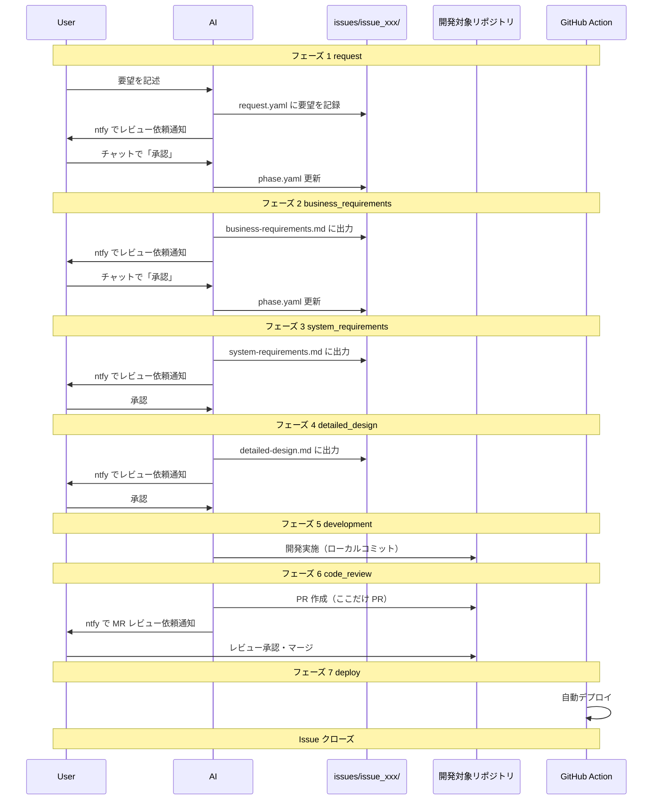

# ai-workspace

AI との協業ワークフローを管理する基盤リポジトリ。

開発対象リポジトリの外側に配置し、要望 → ビジネス要件 → システム要件 → 詳細設計 → 開発 → コードレビュー → デプロイの一連フローを AI と回すための構成・設定・スクリプトを提供する。

## コンセプト

### 課題感

- 仕様駆動開発（cc-sdd, OpenSpec など）のワークフローは存在するが、チーム開発での導入・運用コストを考えると実践しづらい
- メインスレッドを切り替えると AI のコンテキストが消失する。ドメイン知識や設計内容は skills で復帰しやすい一方で、個別タスクの進捗・コンテキストの維持が難しい

### このリポジトリが解決すること

- Issue 単位でワークフローと成果物（要件・設計など）を集約
- フェーズ管理（`phase.yaml`）によりコンテキストを永続化し、セッション切れからの復旧を容易に
- 開発に限らず、調査・相談などのワークフローも同じ仕組みで扱える

## 責務と棲み分け

```
dotfiles (汎用 agent 設定)
└── skills, rules, hooks
    ├── どのリポジトリでも使う共通設定
    └── 基盤リポジトリを介さず直接開発するとき用

ai-workspace (基盤リポジトリ)
└── 開発・調査・相談など Issue 単位のフロー
    ├── ワークフロー専用 skills / rules
    ├── issues/ (作業中の成果物)
    └── config/ (対象リポジトリ指定)
```

| 場所 | 置くもの |
| --- | --- |
| dotfiles | どのリポジトリでも使う汎用 agent 設定（skills, rules, hooks） |
| ai-workspace | Issue 単位のワークフロー、開発対象リポジトリごとの config、成果物（要件・設計など） |
| 開発対象リポジトリ | コード本体。`config/projects.yaml` で path を指定（複数可） |

## リポジトリ構成

```
ai-workspace/
├── README.md
├── config/
│   ├── settings.yaml         # 通知設定など（git 管理外）
│   ├── settings.yaml.template
│   └── projects.yaml         # 開発対象リポジトリ一覧（project_ids で参照）
├── issues/                   # git 管理外（.gitignore）
│   └── issue_001/
│       ├── request.yaml
│       ├── phase.yaml
│       ├── business-requirements.md
│       ├── system-requirements.md
│       └── detailed-design.md
├── scripts/
│   └── ntfy.sh               # ntfy 通知送信
├── .claude/
│   └── CLAUDE.md             # AI 向けフロールール
└── .rulesync/                # rulesync で .cursor / .claude 等に展開
    └── skills/
        └── dev_workflow/     # 開発ワークフロー
            ├── SKILL.md
            ├── references/
            │   └── flow.md   # フェーズ・承認・差し戻しの定義
            └── assets/       # 成果物ひな形
```

## 開発フロー



### フェーズ定義

| フェーズ | 名前 | 説明 |
| --- | --- | --- |
| 1 | request | 要望を `request.yaml` に記録 → ntfy 通知 → 承認で次へ |
| 2 | business_requirements | ビジネス要件を作成 → ntfy 通知 → 承認で次へ |
| 3 | system_requirements | システム要件を作成 → ntfy 通知 → 承認で次へ |
| 4 | detailed_design | 詳細設計を作成 → ntfy 通知 → 承認で次へ |
| 5 | development | 設計に基づき実装。ローカルコミット（PR は作らない） |
| 6 | code_review | **ここだけ PR を作成** → ntfy で PR URL を通知 → マージで完了 |
| 7 | deploy | GitHub Action でデプロイ → Issue クローズ |

### なぜフェーズを分けるのか

- **PR はコードレビュー時のみ**: 要件・設計はローカルファイルで管理し、ノイズを減らす
- **成果物出力 → ntfy → 承認のサイクル**: スマホから SSH して「承認」と言うだけで次へ進める
- **仕様を固めてから実装**: 1 Issue = 1 開発サイクルとして履歴を残す

## セットアップ

### 1. リポジトリをクローン

```bash
git clone https://github.com/your-username/ai-workspace.git
cd ai-workspace
```

### 2. 設定ファイルを作成

```bash
cp config/settings.yaml.template config/settings.yaml
```

`config/settings.yaml` を編集して ntfy トピックを設定:

```yaml
ntfy_topic: "your-secret-topic"
ntfy_base_url: "https://ntfy.sh"  # 省略可（デフォルト: ntfy.sh）
```

### 3. 開発対象プロジェクトを設定

`config/projects.yaml` を編集（各 Issue の `request.yaml` の `project_ids` で id を参照）:

```yaml
projects:
  - id: ai-workspace
    name: "ai-workspace"
    path: "/Users/user/environment/ai-workspace"
    repo: "github.com/kuroweb/ai-workspace"
    default_branch: master
    notes: |
      - ai-workspace 開発用プロジェクト
  - id: my-app
    name: "マイアプリ"
    path: "/Users/user/projects/my-app"
    repo: "github.com/user/my-app"
    default_branch: main
    notes: |
      - アプリ本体リポジトリ
```

### 4. ntfy の設定

1. スマホに [ntfy](https://ntfy.sh) アプリをインストール
2. `config/settings.yaml` の `ntfy_topic` と同じトピックを購読
3. 動作確認:

```bash
bash scripts/ntfy.sh "テスト通知"
```

## 使い方

### 新規 Issue を開始

AI との会話で要望を伝えると、AI が `issues/issue_xxx/` を作成してフローを開始する。

```
ユーザー: タスク管理アプリを作りたい。スマホから使えてシンプルなもの。
AI: issues/issue_001/ を作成し、request.yaml に要望を記録しました。レビューをお願いします。（ntfy で通知）
    [ユーザーが「承認」後] ビジネス要件を作成しています...
```

### 承認・差し戻し

ntfy 通知を受けたら、チャットで承認または差し戻しを伝える。

```
# 承認（承認待ちが 1 件の場合）
ユーザー: 承認

# 特定の Issue を承認
ユーザー: issue_001 承認

# 差し戻し
ユーザー: issue_001 差し戻し: 機能要件に通知機能を追加して
```

### Issue の進行状況確認

```
ユーザー: Issue の状況を教えて
AI: issues/ をスキャンします...
    - issue_001: フェーズ 3 (system_requirements) - 承認待ち
    - issue_002: フェーズ 5 (development) - 進行中
```

## issues/ の扱い

| 方針 | 説明 |
| --- | --- |
| **git 管理外** | `.gitignore` で除外。個人的・機密的な内容を含むため |
| **ローカルのみ** | 作業中の要件・設計は ai-workspace のローカルに保存 |
| **ナレッジの永続化** | 終了した Issue から学びを抽出し、別のデータソースに保存可能 |
| **公開可能** | issues/ を除外すればリポジトリ自体は public 可 |

## ファイルスキーマ

### issues/issue_xxx/request.yaml

```yaml
id: issue_001
project_ids: [my-project]
title: "タスク管理アプリを作りたい"
created_at: "2026-02-14T10:30:00+09:00"
raw_input: |
  スマホから使えるシンプルなタスク管理アプリを作りたい。
  - タスクの追加・完了・削除
  - 期限設定
  - ntfy で期限通知
```

### issues/issue_xxx/phase.yaml

```yaml
current_phase: 2
waiting_approval: true

phases:
  1:
    name: "request"
    status: "completed"
  2:
    name: "business_requirements"
    status: "in_progress"
    output: "business-requirements.md"
    rejection_reason: null
  3:
    name: "system_requirements"
    status: "pending"
    output: "system-requirements.md"
  # ... 以降のフェーズ
```

## 通知方式

- 基本は **ntfy**（`scripts/ntfy.sh`）
- フェーズ 1〜4: 成果物のローカルパスを案内（フェーズ 1 は request.yaml のレビュー依頼）
- フェーズ 6: PR URL を通知に含める

```bash
# フェーズ 2〜4
bash scripts/ntfy.sh "📋 ビジネス要件を書きました。レビューをお願いします"

# フェーズ 6
bash scripts/ntfy.sh "📋 MR レビュー依頼: https://github.com/user/repo/pull/123"
```

## dotfiles との連携

- **rulesync**: ai-workspace でも rulesync を使い、複数 Agent（Cursor, Claude Code など）で設定を共有
- **定期的な移植**: ai-workspace で育てた skills / rules のうち汎用的なものは dotfiles へ移行
- **context-load**: skills に「指定した issue_xxx を読み込んでコンテキストを復元する」処理を実装

