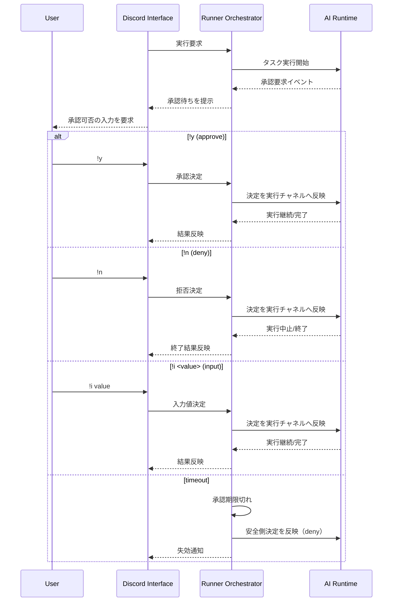
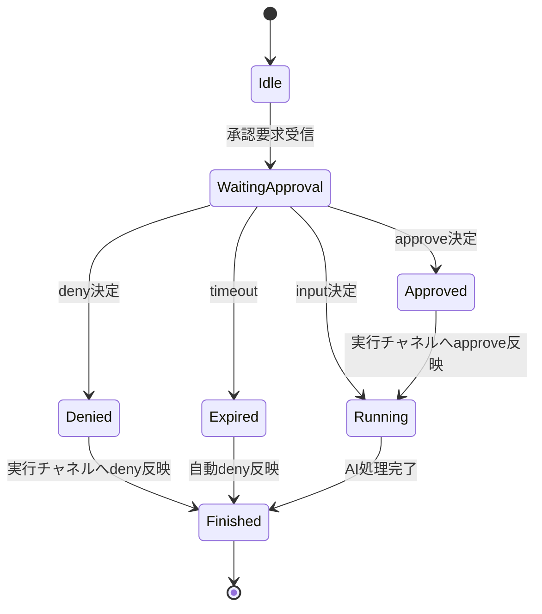

# 実行権限確認の入力対応

- **Status:** open
- **Created:** 2026-03-06
- **Category:** タスク
- **target:** discord-ai-runner

## 概要

`codex` / `claude` の dangerously 系フラグを使わない前提で、AI 実行中に発生する権限確認へ Discord 上のユーザー入力で応答できるようにする。
承認待ちイベントの受信、ユーザー応答の反映（`claude -p` は `--permission-prompt-tool` 経由）までを一連で成立させる。
あわせて承認・拒否の実績をログ化し、運用で `.claude/settings.json` の `allow` / `deny` を調整できる状態を作る。

## 前提

- `--dangerously-bypass-approvals-and-sandbox` と `--dangerously-skip-permissions` は使わない。
- メイン運用は承認要求が極力発生しない権限コントロールを目指す。
- 本番運用は `launchd` 常駐のため、TTY 対話ではなく Discord 経由で承認操作する。
- 承認ログを定期的に見直し、`allow` / `deny` の見直しに反映する。

## スコープ

- 実行権限の承認要求に対する Discord 応答
- 承認決定の AI 実行チャネルへの反映（AI ごとの方言を使い分ける）
- タイムアウト・重複応答・無効入力の制御
- 承認要求/応答の監査ログ記録と、設定調整に使うための可視化

## タスク

- [x] 現状フローの調査（AI 実行開始〜応答返却）を完了する
- [x] 実装方針の設計（責務分離・状態管理・I/O 境界）を確定する
- [x] 詳細設計（型・状態遷移・コマンド仕様・テスト観点）を確定する
- [ ] `codex` / `claude` の dangerously 系フラグを実行引数から削除する
- [ ] `claude -p` 用に `--permission-prompt-tool` 連携を実装する（次着手）
- [ ] AI アダプタで承認要求イベントを受信できるようにする
- [ ] Discord 上で承認待ち内容を提示し、`!y` / `!n` / `!i <value>` を受け付ける
- [ ] ユーザー応答を各 AI 実行チャネルへ返す連携を実装する
- [ ] タイムアウト・無効入力・重複応答・中断時の挙動を定義してテストする
- [ ] 承認要求と最終決定（approve/deny/input）を永続ログとして保存する
- [ ] ログから `.claude/settings.json` の `allow` / `deny` 候補を抽出する運用手順を定義する

## 実装前確定事項（確定）

1. Claude 方言（`claude -p`）
- 承認要求は Claude 実行時の承認チャネルイベントを `ApprovalRequest` に正規化して扱う。
- 承認応答はアダプタの `respondApproval(requestId, decision, inputText?)` から Claude 側承認チャネルへ返す。
- Bot/Service 層は Claude 固有の入出力形式を扱わない。

2. Codex 方言（`codex exec --json`）
- 承認要求は Codex の JSON イベントを `ApprovalRequest` に正規化して扱う。
- 承認応答はアダプタの `respondApproval(requestId, decision, inputText?)` から Codex 側承認チャネルへ返す。
- Bot/Service 層は Codex 固有の入出力形式を扱わない。

3. timeout / 中断時の最終動作
- timeout は `deny` を自動送信して pending を破棄する。
- `!reset` / 新規 revision による中断時も `deny` を送信して pending を破棄する。
- 反映失敗時はセッション失敗としてユーザーへ通知し、pending を破棄する。

## 実装方針（簡潔）

- アダプタ層: 承認要求イベントを受け取り、ユーザーの承認結果を実行チャネルへ返せるようにする（Claude/Codex の方言を吸収）。
- Bot層: Discord コマンド入力（`!y` / `!n` / `!i <value>`）を受け付け、承認待ち中の要求にだけ紐づけて処理する。
- 状態管理: 承認要求は `requestId` 単位で1回だけ確定可能にし、完了/タイムアウト/中断で必ず破棄する。
- 例外系: 無効入力・重複入力・タイムアウトの挙動を固定して先にテスト化する。

## 実行チャネル方言

- Claude (`claude -p`)
  - 非対話モード前提。承認応答は Claude 側が提供する承認チャネルに返す。
- Codex (`codex exec --json`)
  - Codex 側の承認イベント/承認応答フォーマットに合わせて返す。
- 重要方針
  - Bot 層は共通コマンド（`!y` / `!n` / `!i <value>`）のみ扱う。
  - 方言変換はアダプタ層に閉じ込める。

## 設計コンセプト

- Single Source of Truth: 承認待ち状態は `approval service` に集約し、Bot/Adapter が直接 Map を持たない。
- Boundary First: 「Discord入力」と「AI実行チャネル」の境界を明示し、I/O 変換をアダプタに閉じ込める。
- Idempotent by default: 同一 `requestId` への2回目以降の応答は副作用なしで扱う。
- Fail Closed: タイムアウトや不正入力時は安全側（deny）に倒す。

## 実行フロー（抽象シーケンス）



## 詳細設計

### 1. コンポーネント責務

- `adapters/*`
  - AI プロセス起動 (`spawn`)
  - 承認要求イベントの抽出
  - 承認結果の実行チャネル反映（方言変換を担当）
- `bot/discord-handler.ts`
  - Discord コマンド（`!y` / `!n` / `!i <value>`）の受理
  - スレッド単位で承認対象を特定
- `bot/respond.ts`
  - 実行中セッションと承認状態の紐付け
  - 進捗メッセージ更新
- `bot/approval-service.ts`（新規想定）
  - pending 承認の登録/解決/失効
  - 冪等制御（同一 requestId の二重決定防止）

### 2. データ構造

```ts
type ApprovalDecision = 'approve' | 'deny' | 'input';

interface ApprovalRequest {
  requestId: string;
  threadId: string;
  sessionId?: string;
  commandSummary: string;
  requestedAt: number;
  deadlineAt: number;
}

interface ApprovalResolution {
  requestId: string;
  decision: ApprovalDecision;
  inputText?: string;
}
```

### 3. インターフェース

```ts
interface AiAdapterRunOptions {
  signal?: AbortSignal;
  onChunk: (text: string) => void;
  onApprovalRequest: (req: ApprovalRequest) => void;
}

interface AiAdapter {
  run(prompt: string, sessionId: string | undefined, options: AiAdapterRunOptions): Promise<AiResult>;
  respondApproval(requestId: string, decision: ApprovalDecision, inputText?: string): Promise<void>;
}

interface ApprovalService {
  register(req: ApprovalRequest): void;
  resolve(resolution: ApprovalResolution): { ok: boolean; reason?: string };
  getPendingByThread(threadId: string): ApprovalRequest | undefined;
  expire(now: number): ApprovalRequest[];
  clearByThread(threadId: string): void;
}
```

### 4. 状態遷移



### 5. Discord コマンド仕様

- 入力手段（Discord）
  - `!y`: approve
  - `!n`: deny
  - `!i <value>`: input
- `!y`
  - 対象: スレッド内の最新 pending request
  - 成功時: 「承認しました（requestId: xxx）」を返信
  - pending なし: 「承認待ちはありません」を返信
- `!n`
  - 対象: スレッド内の最新 pending request
  - 成功時: 「拒否しました（requestId: xxx）」を返信
  - pending なし: 「承認待ちはありません」を返信
- `!i <value>`
  - 対象: スレッド内の最新 pending request
  - 成功時: 「入力を送信しました（requestId: xxx）」を返信
  - pending なし: 「承認待ちはありません」を返信
- 無効入力
  - `!i` 単体など不正形式は usage を返信

### 6. 例外・競合制御

- 二重応答: 2件目は no-op で「すでに確定済み」を返信
- 実行中断 (`!reset` / 新規 revision): pending を破棄し、deny を送信
- 承認結果反映失敗（permission-prompt-tool 連携失敗を含む）: セッション失敗として扱い、ユーザーへ明示
- timeout: `deadlineAt` 超過時に自動 deny

### 7. テスト観点

- 正常系:
  - 承認要求 -> `!y` -> 実行継続 -> 完了
  - 承認要求 -> `!n` -> 実行終了
  - 入力要求 -> `!i value` -> 実行継続 -> 完了
- 異常系:
  - pending なしで `!y` / `!n` / `!i <value>`
  - 同一 request へ連続 `!y`
  - `!i` 単体（値なし）
  - timeout 自動 deny
  - 実行中断時の pending 破棄
  - `reset` とユーザー応答が同時到着した場合に `reset` が勝つ
  - revision 更新と旧 request 応答が競合した場合に旧 request は no-op
- 回帰:
  - `!status` / `!reset` の既存挙動が壊れない

### 8. 権限ログ運用設計

- 目的:
  - 権限確認の実績を記録し、恒常的に発生する承認要求を `allow` へ寄せる。
  - 危険な要求や不要な要求を `deny` へ寄せる。
- ログ記録項目（最小）:
  - timestamp
  - agent (`claude` / `codex`)
  - requestId
  - threadId
  - commandSummary
  - decision (`approve` / `deny` / `input`)
  - inputText（存在時のみ）
- 運用フロー:
  - 実行時に承認要求と決定をログへ追記する。
  - 定期的にログを確認し、反復して許可される操作を `allow` 候補として抽出する。
  - 拒否が多い操作・高リスク操作を `deny` 候補として抽出する。
  - 候補をレビュー後に `.claude/settings.json` へ反映する。
  - 反映後の承認要求件数を観測し、効果を確認する。

## 受け入れ条件

- Claude 実行で承認要求が発生したとき、`!y` / `!n` / `!i <value>` が期待どおり反映される。
- Codex 実行で承認要求が発生したとき、`!y` / `!n` / `!i <value>` が期待どおり反映される。
- timeout / `!reset` / revision 中断の各ケースで `deny` が送信され、pending が残らない。
- 承認要求ごとに監査ログが保存され、少なくとも `decision` と `commandSummary` が追跡できる。
- ログレビュー結果をもとに `.claude/settings.json` の `allow` / `deny` を更新する運用手順が定義されている。

## 調査ログ（2026-03-06）

### 1. 現状コードの課題（dangerously なし前提で不足する点）

- `claude -p` / `codex exec --json` の承認応答方言を吸収する実装がない。
- 現状実装には承認応答経路がなく、Discord 入力を返せない。
- `stdout` JSON パースは通常応答中心で、承認要求イベント処理の分岐がない。
  - 参照: `projects/discord-ai-runner/src/adapters/codex.ts:48-59`
  - 参照: `projects/discord-ai-runner/src/adapters/claude.ts:56-81`
- Discord 側に承認操作コマンドがなく、承認待ち状態の管理も未実装。
  - 参照: `projects/discord-ai-runner/src/bot/discord-handler.ts:27-45`
  - 参照: `projects/discord-ai-runner/src/bot/respond.ts:39-100`

## 対応方針まとめ

- dangerously 系フラグなし運用を前提とする。
- 必須要件は「承認応答連携」であり、Discord の承認操作を AI 実行チャネルへ返せる設計にする。
- 承認待ち状態管理と例外系ハンドリングをセットで実装する。
